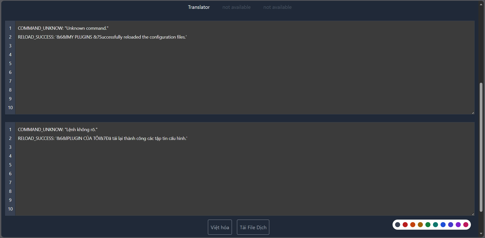
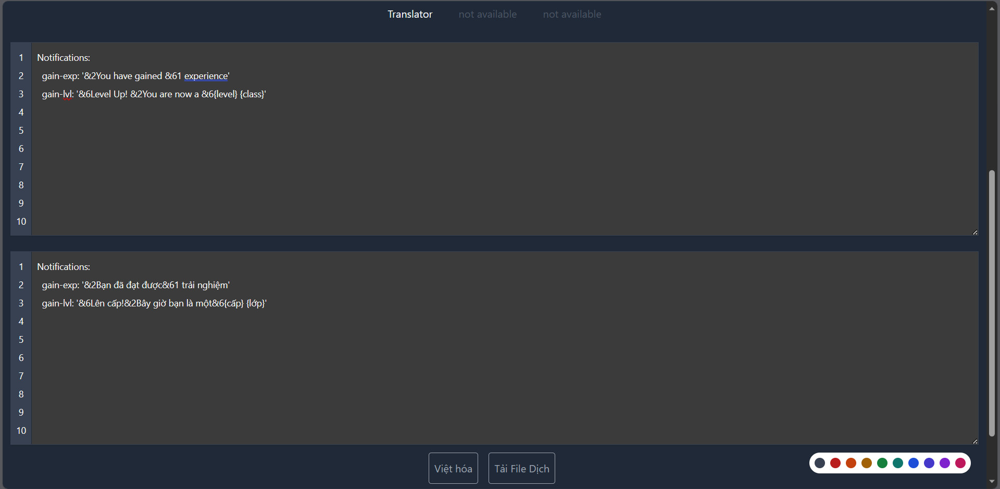
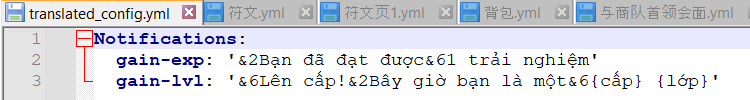
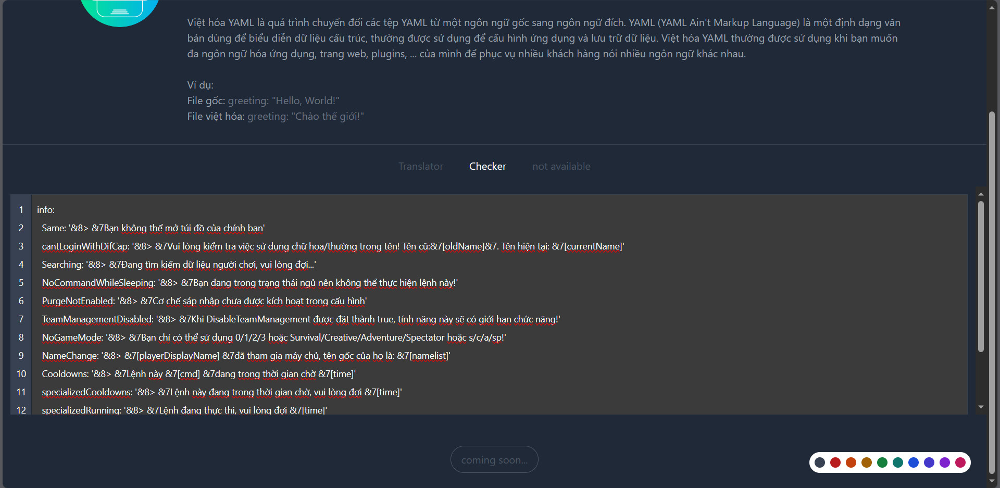
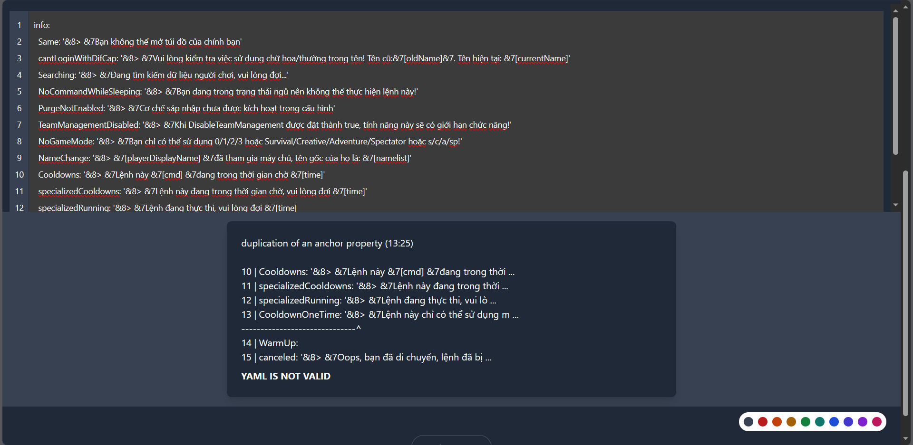

📑 YAML TOOLS 

# Các file hỗ trợ: 
- ⚙ Yaml (YAML Ain't Markup Language) `.yaml`
- ⚙ Yml `.yml`
- ⚙ Text `.text`

# Chức năng hiện tại:
- 🔗 Việt hóa
- 🔗 Kiểm tra

--------------------------- 
- 🌵 Giao diện chính
  

- 🌵 Việt hóa
  + Dạng 1:
  
  + Dạng 2:
  

- 🌵 Tải file đã dịch
  

- 🌵 Kiểm tra
  + Đúng (true):
  
  + Sai (false):
  
